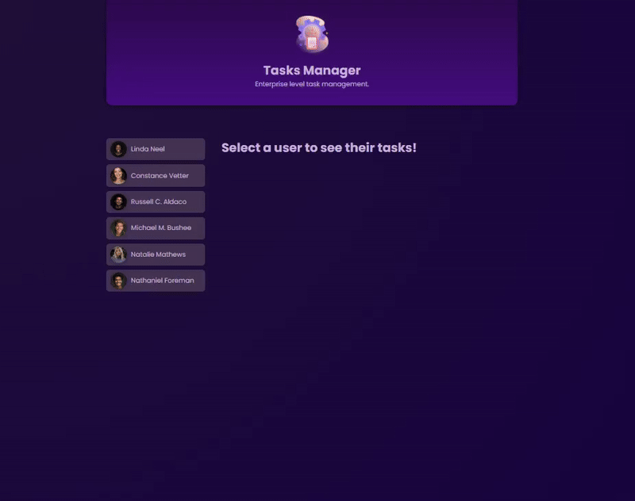

<h1 style="text-align: center;"> Angular Task Manager App 🗒️✏️</h1>
This angular Task Manager App is a dynamic and responsive web application designed to help users efficiently organize and manage their daily tasks. Built entirely with Angular, the app leverages the framework's powerful features for component-based development, reactive programming, and seamless data handling.

# Demo ☂️

# Features ✨
- Users can create, and delete tasks effortlessly. 💻
- Tasks include fields like a title, description, and due date. 

# Technologies & Tools Used 🛠️
- Angular
- Typescript
- HTML
- CSS

# Installation and Usage 🪄
To use this app, first you need to follow these steps:

- Clone the repository or download the source code.
- Open the project in your preferred code editor.
- Run  `npm install` to install the necessary dependencies.
- Run `npm start` to start the development server.
- Open your browser and navigate to `http://localhost:3000` to use the app.

# Using the app
<h2>👩🏾‍💻 View a User's Tasks: </h2> 
On the homepage, you’ll see a list of user names.
Click on a user’s name to view their associated tasks.
The app will display all tasks for the selected user.

<h2>➕ Add a New Task:</h2> 
While viewing a user’s task list, click the “Add Task” button.
Fill in the required fields such as the task title, description, and due date in the provided form.
Once submitted, the new task will appear in the user’s task list and be saved automatically in local storage.

<h2>✔️ Mark a Task as Completed:</h2>
Locate the task you want to mark as completed in the user’s task list.
Click the “Mark as Completed” button or checkbox next to the task.
The task's status will update, and the taks will disapear of the list.

🗃️ Data Persistence:
All user tasks, including updates or new tasks, are automatically saved in the browser’s local storage.
The information remains available even if the app is refreshed.
This app provides an intuitive way to manage tasks for multiple users while ensuring all data is secure and always accessible through local storage.

# License
This project is licensed under the MIT license.
